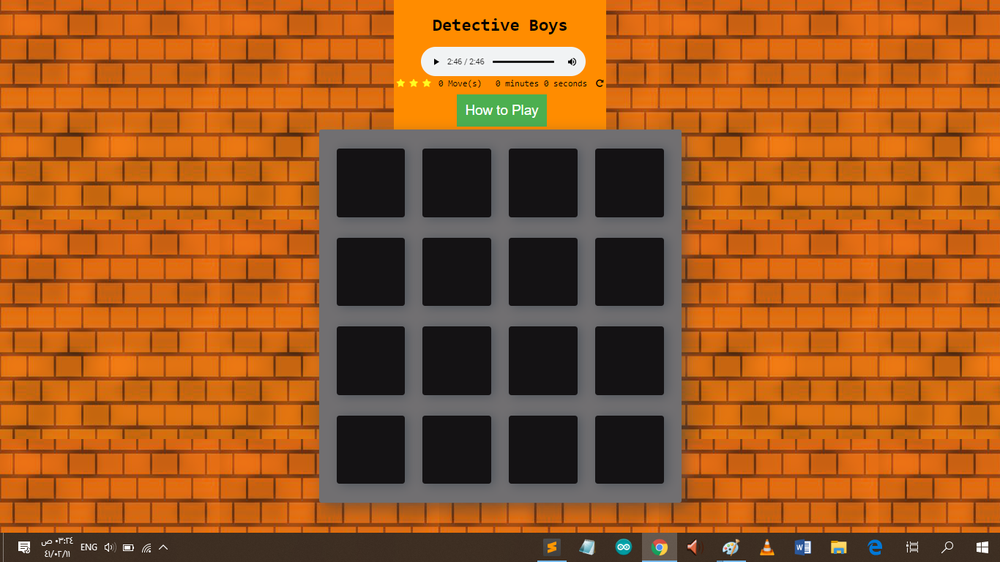
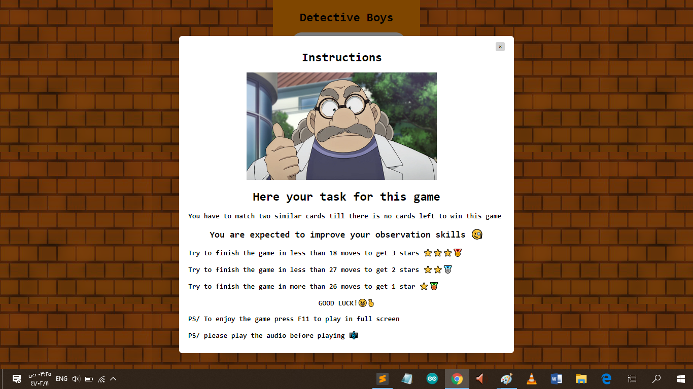
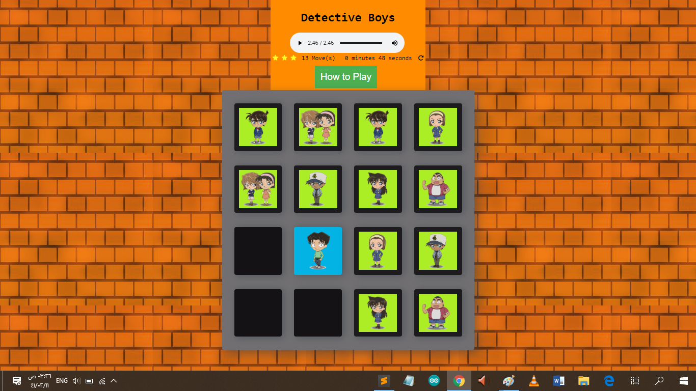
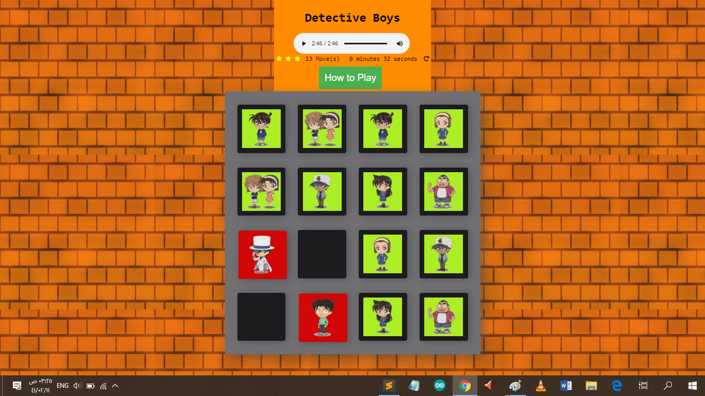
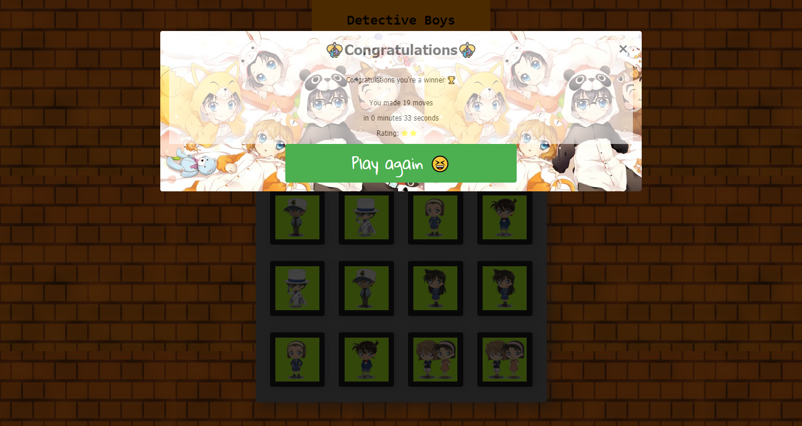

# Memory-Game-Detective-Boys-
It is a game to test the player memory where the player has to match similar cards until there are no cards left to win the game.

# Game Interface
 

# How to play pop-up Message

# Instructions on how to play
1- Click the cards to know the place of every character. 
2- Match the similar cards. 
3- Try to match all the cards in a short time and with the least moves. 

# Star Rating
1-Try to finish the game in less than 18 moves to get 3 stars ⭐️⭐️⭐️🥇 
2-Try to finish the game in less than 27 moves to get 2 stars ⭐️⭐️🥈 
3-Try to finish the game in more than 26 moves to get 1 star ⭐️🥉 

# How I made the Memory Game

1- I downloaded the template from udacity. 
2- Adjusted the code so that it shuffles the cards when game is refreshed. 
3- Created a counter to count the number of moves made by the player and a timer to count the duration of the game. 
4- Added some animations effects to cards when they are valid match and unvalid match. 
5- Created a pop-up modal that tell the user how to play the game. 
6- Created a pop-up modal that show up when the player wins the game. 
7- Added the music theme of Detective Conan.

# Valid Match

# Unvalid Match

# Congratulations pop-up

